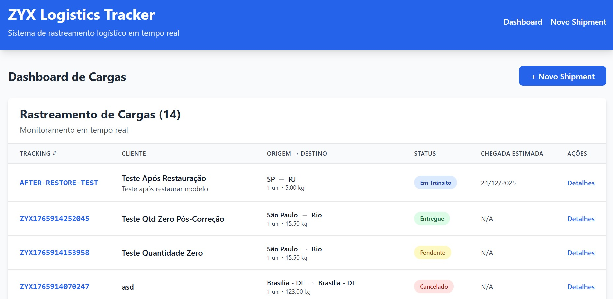
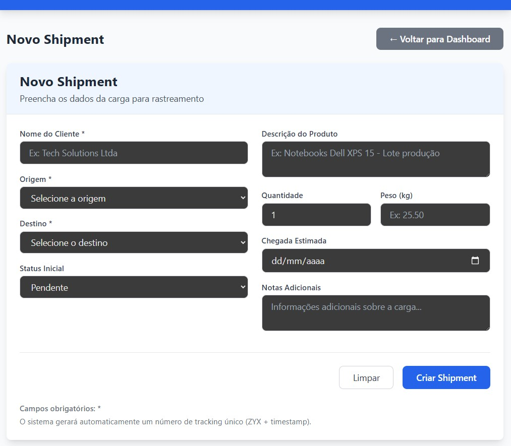
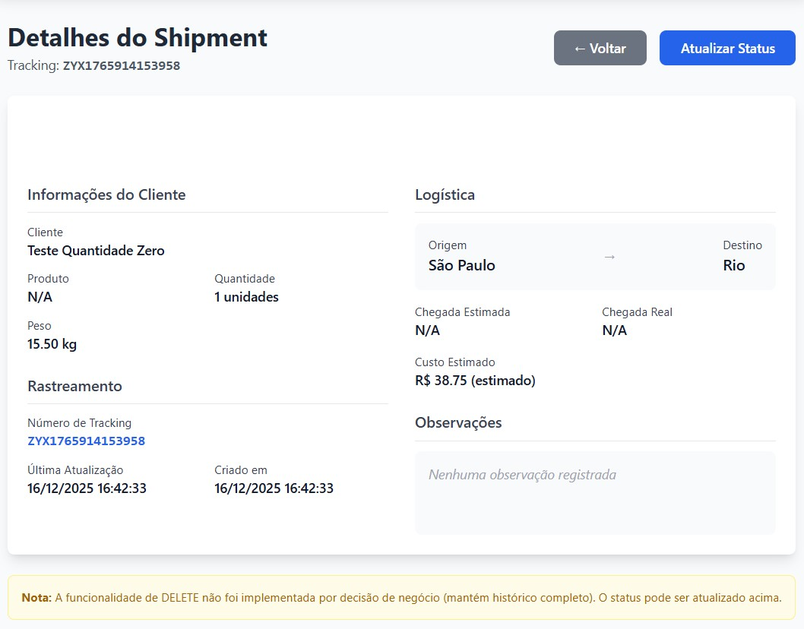
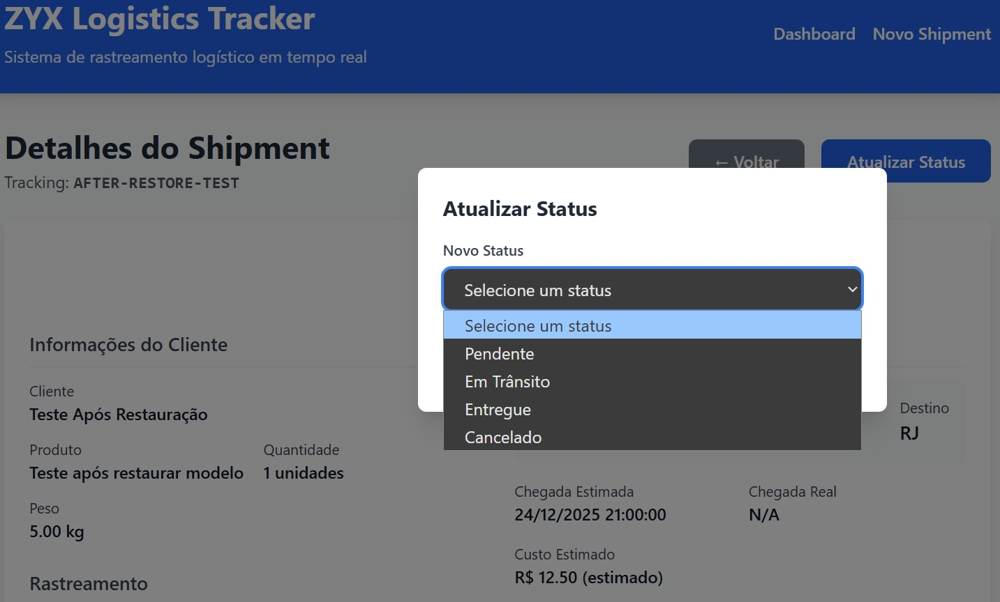

# ZYX Logistics Tracker v1.0

Sistema completo de rastreamento logístico desenvolvido para o teste técnico da DHL (Analista de Sistemas Operacionais JR). **Versão 1.0 - 19/12/2025**.

## Objetivo do Projeto

Digitalizar os processos logísticos da ZYX Logística, resolvendo os gargalos críticos identificados:
- **Inbound**: Recebimento de cargas com controle eficiente
- **Inventário**: Controle e rastreabilidade de shipments
- **Entrada/Saída**: Registro eletrônico do que entra e sai
- **Expedição**: Lançamento e controle eficiente
- **Relatórios**: Dashboard em tempo real com status consolidado

## Stack Tecnológico

### Backend (TypeScript)
- **Node.js 20** + **Express** - API REST robusta
- **TypeScript** - Tipagem estática e segurança em tempo de desenvolvimento
- **PostgreSQL 15** - Banco de dados relacional para dados transacionais
- **Docker** + **Docker Compose** - Containerização e ambiente reproduzível
- **RESTful API** - 5 endpoints completamente implementados e testados

### Frontend (TypeScript)
- **React 18** + **Vite** - Interface moderna com build rápido
- **TypeScript** - Tipagem estática para melhor manutenibilidade
- **Tailwind CSS** - Design system utilitário e responsivo
- **React Router 6** - Navegação SPA com rotas aninhadas
- **Axios** - Comunicação HTTP com interceptors e tratamento de erros

## Estrutura do Projeto

```
zyx-logistics-tracker/
├── backend/               # API REST TypeScript
│   ├── src/               # Código fonte TypeScript
│   │   ├── controllers/   # shipmentController.ts
│   │   ├── db/            # connection.ts (pool PostgreSQL)
│   │   ├── routes/        # shipmentRoutes.ts
│   │   └── types/         # shipment.types.ts (tipos e interfaces)
│   ├── dist/              # JavaScript compilado (build)
│   ├── tests/             # Scripts de teste e validação
│   ├── init-scripts/      # Schema do banco de dados
│   ├── Dockerfile         # Containerização do backend
│   ├── package.json       # Dependências e scripts
│   └── tsconfig.json      # Configuração TypeScript
├── frontend/              # Interface React TypeScript
│   ├── src/
│   │   ├── components/    # Componentes TSX (ShipmentList, Form, Detail)
│   │   ├── services/      # api.ts (cliente HTTP)
│   │   ├── types/         # shipment.types.ts
│   │   ├── utils/         # statusUtils.ts
│   │   └── assets/        # Recursos estáticos
│   ├── docs/              # Histórico de desenvolvimento
│   ├── Dockerfile         # Containerização do frontend
│   ├── package.json       # Dependências e scripts
│   └── tsconfig.json      # Configuração TypeScript
├── development-log/       # 26+ sessões documentadas
│   └── dezembro/          # Logs organizados por data
├── docs/                  # Documentação e screenshots
│   └── screenshots/       # Imagens do sistema em funcionamento
├── docker-compose.yml     # Orquestração completa dos serviços
└── README.md              # Esta documentação
```

## Como Executar o Projeto

### Método 1: Docker Compose (Recomendado - 1 comando)
```bash
# Inicia todos os serviços com um único comando
docker-compose up -d

# Acesse as aplicações:
# Frontend:    http://localhost:5173
# Backend API: http://localhost:5000
# Banco dados: localhost:5434

# Para parar os serviços:
docker-compose down
```

### Método 2: Desenvolvimento Local
```bash
# 1. Banco de dados PostgreSQL
docker-compose up db -d

# 2. Backend (terminal 1)
cd backend
npm install
npm run dev        # API em http://localhost:5000

# 3. Frontend (terminal 2)
cd frontend
npm install
npm run dev        # App em http://localhost:5173
```

### Método 3: Produção (Build otimizado)
```bash
# 1. Build do backend
cd backend
npm run build      # Gera código em dist/

# 2. Executar produção
npm start          # Usa dist/server.js

# 3. Frontend build
cd frontend
npm run build      # Gera arquivos em dist/
```

## API Endpoints

| Método | Endpoint                                  | Descrição                       | Status       | Validações                                                |
|--------|-------------------------------------------|---------------------------------|--------------|-----------------------------------------------------------|
| GET    | `/api/shipments`                          | Lista todos os shipments        | Implementado | Paginação pronta                                          | 
| GET    | `/api/shipments/:id`                      | Busca shipment por ID           | Implementado | ID numérico                                               | 
| GET    | `/api/shipments/tracking/:trackingNumber` | Busca por tracking number       | Implementado | UUID format                                               | 
| POST   | `/api/shipments`                          | Cria novo shipment              | Implementado | Todos campos obrigatórios, quantity ≥ 1                   | 
| PUT    | `/api/shipments/:id/status`               | Atualiza status do shipment     | Implementado | Status válidos: PENDING, IN_TRANSIT, DELIVERED, CANCELLED | 

## Screenshots do Sistema em Funcionamento

### Dashboard
- **Dashboard Principal** - Visão geral de todos os envios com status e informações essenciais
  

### Formulários e Interação
- **Formulário de Gerenciamento** - Interface para criar e gerenciar envios
  

### Detalhes e Visualização
- **Página de Detalhes** - Informações completas e específicas de um envio
  

### Atualizações e Modais
- **Modal de Atualização** - Interface para atualizar o status e informações de um envio
  


## Funcionalidades Implementadas

### CRUD Completo (Exceto Delete por decisão de negócio)
- **CREATE**: Formulário com validação em tempo real para novos shipments
- **READ**: Listagem paginada + página de detalhes individuais
- **UPDATE**: Atualização de status via modal com confirmação
- **DELETE**: Intencionalmente não implementado - em logística, histórico é crucial

### Interface de Usuário Profissional
- Dashboard responsivo com **Tailwind CSS**
- Navegação SPA com **React Router** (3 páginas distintas)
- Feedback visual em todas as ações (loading, success, error states)
- Sistema de cores para status (🟡 Pendente, 🔵 Em Trânsito, 🟢 Entregue, 🔴 CANCELLED)
- Design acessível com contraste adequado

### Integração Robusta Backend-Frontend
- Proxy Vite configurado para evitar problemas de CORS
- Logs de requisições em tempo real no backend
- Validações em três camadas: frontend, backend e banco de dados
- Tratamento de erros elegante com mensagens amigáveis ao usuário
- Tipagem compartilhada entre frontend e backend

## Banco de Dados PostgreSQL

### Schema Otimizado
```sql
-- Tabela principal
CREATE TABLE shipments (
    id SERIAL PRIMARY KEY,
    tracking_number VARCHAR(50) UNIQUE NOT NULL,
    customer_name VARCHAR(100) NOT NULL,
    origin VARCHAR(100) NOT NULL,
    destination VARCHAR(100) NOT NULL,
    quantity INTEGER NOT NULL CHECK (quantity >= 1),
    weight DECIMAL(10,2) NOT NULL,
    value DECIMAL(10,2) NOT NULL,
    description TEXT,
    status VARCHAR(20) DEFAULT 'PENDING',
    expected_delivery DATE,
    created_at TIMESTAMP DEFAULT CURRENT_TIMESTAMP,
    updated_at TIMESTAMP DEFAULT CURRENT_TIMESTAMP
);

-- Tabela de histórico (pronta para expansão)
CREATE TABLE shipment_tracking (
    id SERIAL PRIMARY KEY,
    shipment_id INTEGER REFERENCES shipments(id),
    status VARCHAR(20),
    location VARCHAR(100),
    notes TEXT,
    created_at TIMESTAMP DEFAULT CURRENT_TIMESTAMP
);

-- View para dashboard
CREATE VIEW vw_shipment_dashboard AS 
SELECT 
    status,
    COUNT(*) as total,
    SUM(value) as total_value,
    AVG(quantity) as avg_quantity
FROM shipments 
GROUP BY status;
```

### Constraints e Validações
1. **`quantity >= 1`** - Validação em todas as camadas (banco, backend TypeScript, frontend)
2. **`tracking_number UNIQUE`** - Garante unicidade para rastreamento
3. **Valores padrão** - `status DEFAULT 'PENDING'`, timestamps automáticos
4. **Chaves estrangeiras** - Relacionamento shipment_tracking → shipments

### Dados de Exemplo Incluídos
O sistema vem com 10+ shipments de exemplo que demonstram:
- Todos os status possíveis (PENDING, IN_TRANSIT, DELIVERED)
- Clientes variados (Tech Solutions, Global Import, Distribuidora XYZ)
- Rotas geográficas diversas (São Paulo → Rio, Fortaleza → Salvador, etc.)
- Tipos de carga realistas (eletrônicos, alimentos, máquinas industriais)
- Valores e quantidades variadas para testes realísticos

## Decisões Técnicas e Arquitetura

### 1. Migração Completa para TypeScript
- **Backend**: JavaScript → TypeScript com tipagem estrita
- **Frontend**: JSX → TSX com interfaces compartilhadas
- **Benefício**: Maior segurança, autocomplete inteligente, melhor manutenibilidade

### 2. Containerização com Docker
- **Serviços isolados**: PostgreSQL, Backend Node.js, Frontend React
- **Volumes persistente**: Dados do banco sobrevivem a reinicializações
- **Networks dedicadas**: Comunicação segura entre containers
- **Reprodutibilidade**: Ambiente idêntico em qualquer máquina

### 3. Validação Multi-camada
```typescript
// 1. Frontend (React + Formik)
const validationSchema = Yup.object({
    quantity: Yup.number().min(1, 'Quantity must be at least 1').required()
});

// 2. Backend (TypeScript)
if (quantity < 1) {
    throw new Error('Quantity must be at least 1');
}

// 3. Banco de dados (PostgreSQL CONSTRAINT)
CHECK (quantity >= 1)
```

### 4. Git Flow Estruturado
- **main**: Código de produção
- **develop**: Integração contínua
- **feat/***: Novas funcionalidades
- **fix/***: Correções de bugs
- **Tags versionadas**: v1.0, v1.1, etc.

## Processo de Desenvolvimento Documentado

O projeto foi desenvolvido em **26+ sessões completamente documentadas**, organizadas em `development-log/dezembro/`. Esta documentação demonstra:

### Metodologia Iterativa
1. **Setup inicial** (01-03/12): Ambiente, Docker, PostgreSQL
2. **Backend JavaScript** (04-06/12): API REST, models, controllers
3. **Frontend React** (06-08/12): Components, integração com API
4. **Migração TypeScript** (09-15/12): Backend e frontend tipados
5. **Dockerização completa** (16-19/12): Containers, otimização, v1.0

### Resolução de Problemas
- **Constraint quantity**: Corrigido em todas as camadas
- **TypeScript migration**: Build configurado corretamente
- **Docker networking**: Comunicação entre serviços resolvida
- **Git workflow**: Branches, merges e sincronização

### Qualidade de Código
- **Type checking** em todo o stack
- **Scripts de teste** incluídos (`backend/tests/`)
- **Logs de desenvolvimento** como evidência do processo
- **Backups históricos** mostrando evolução (`frontend/docs/development-history/`)

## Testes e Validação

### Scripts de Teste Incluídos (`backend/tests/`)
- **`simple-test.js`**: Teste básico dos modelos e conexão com banco
- **`backend-test-final.sh`**: Teste completo da API (122 linhas)
- **`test-api.sh`**: Testes automatizados de endpoints

### Validação Manual Realizada
1. **CRUD completo**: Create, Read, Update testados extensivamente
2. **Validações**: Campos obrigatórios, quantity ≥ 1, status válidos
3. **Interface**: Responsividade, usabilidade, feedback ao usuário
4. **Performance**: Logs mostram resposta em milissegundos

## Roadmap e Expansões Futuras

### Prioridade Alta
1. **Autenticação JWT**: Sistema de login com diferentes níveis de acesso
2. **Filtros Avançados**: Busca por data, status, cliente, origem/destino
3. **Exportação de Dados**: PDF, Excel para relatórios empresariais

### Prioridade Média
4. **Notificações**: Email/SMS para atualizações importantes de status
5. **API Externa**: Integração com Google Maps para visualização de rotas
6. **Dashboard Analítico**: Gráficos, métricas de performance logística

### Prioridade Baixa
7. **Mobile App**: Versão React Native para acompanhamento em campo
8. **Machine Learning**: Previsão de atrasos baseada em histórico
9. **Multi-tenancy**: Suporte a múltiplas empresas no mesmo sistema

## Métricas do Projeto

- **Linhas de código**: ~1.500 (TypeScript/TSX)
- **Sessões de desenvolvimento**: 26+ documentadas
- **Endpoints API**: 5 completamente implementados
- **Componentes React**: 3 principais + utilitários
- **Tabelas PostgreSQL**: 2 + 1 view
- **Containers Docker**: 3 serviços (db, backend, frontend)
- **Dias de desenvolvimento**: 19 dias (01-19/12/2025)

---

## Informações para Avaliação

### Para a Equipe de Avaliação da DHL:
1. **Execute com 1 comando**: `docker-compose up -d`
2. **Acesse**: http://localhost:5173
3. **Teste funcionalidades**:
   - Listagem de shipments
   - Criação de novo shipment
   - Detalhes de shipment específico
   - Atualização de status
4. **Verifique logs**: Console do backend mostra operações em tempo real
5. **Analise código**: TypeScript tipado, estrutura limpa, documentação completa

### Evidências de Qualidade Incluídas:
- 26+ sessões de desenvolvimento documentadas
- Screenshots de todas as funcionalidades
- Scripts de teste e validação
- Histórico de commits organizado
- Constraints validadas em 3 camadas
- Dockerização completa e funcional

---

**Desenvolvido por**: Victor Luiz de França  
**Cargo Alvo**: Analista de Sistemas Operacionais JR - DHL  
**Data da Versão**: 19/12/2025  
**Versão**: 1.0 (Pronto para produção)  
**Repositório**: https://github.com/victorlzfr/zyx-logistics-tracker  
**Status do Projeto**: **COMPLETO E PRONTO PARA AVALIAÇÃO**

> *Nota: Este projeto foi desenvolvido especificamente para o teste técnico da DHL, demonstrando habilidades em desenvolvimento full-stack, Docker, TypeScript, PostgreSQL e metodologias ágeis de desenvolvimento.*
