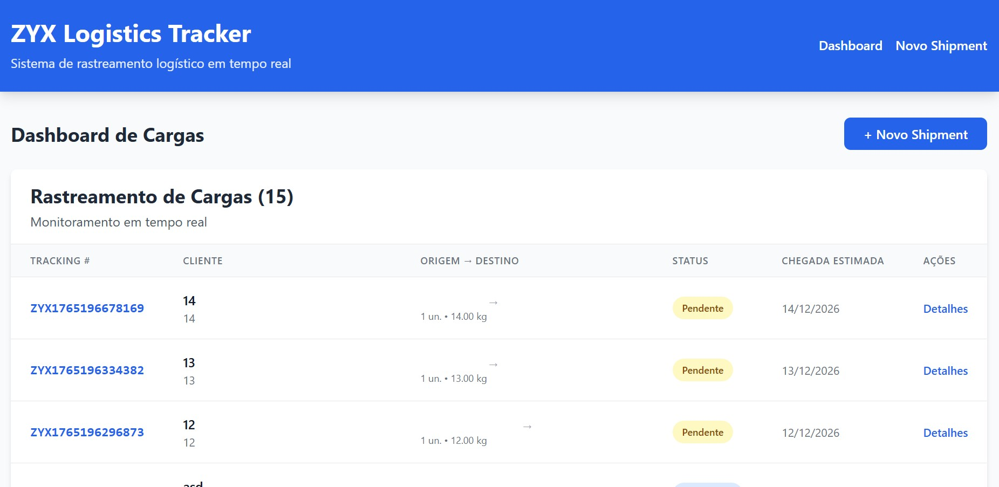
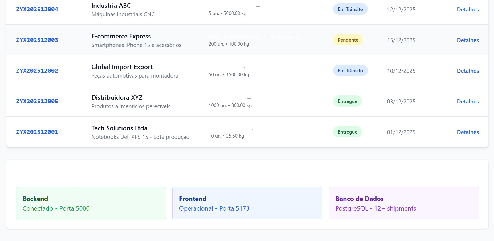
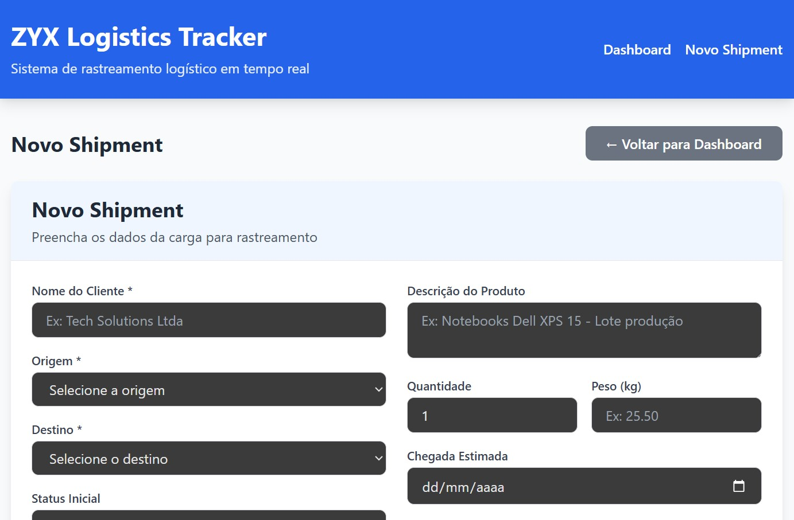
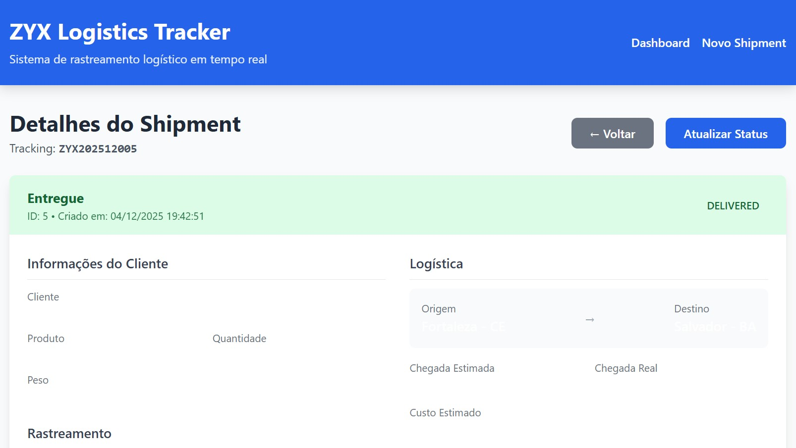
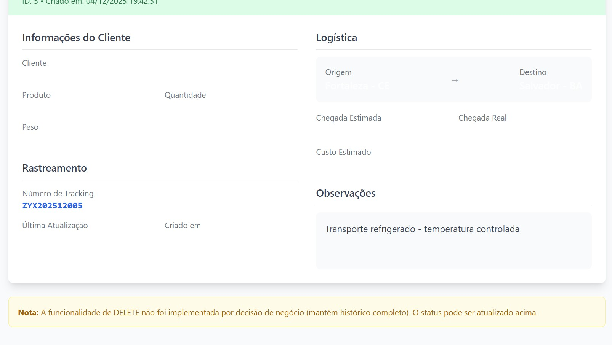
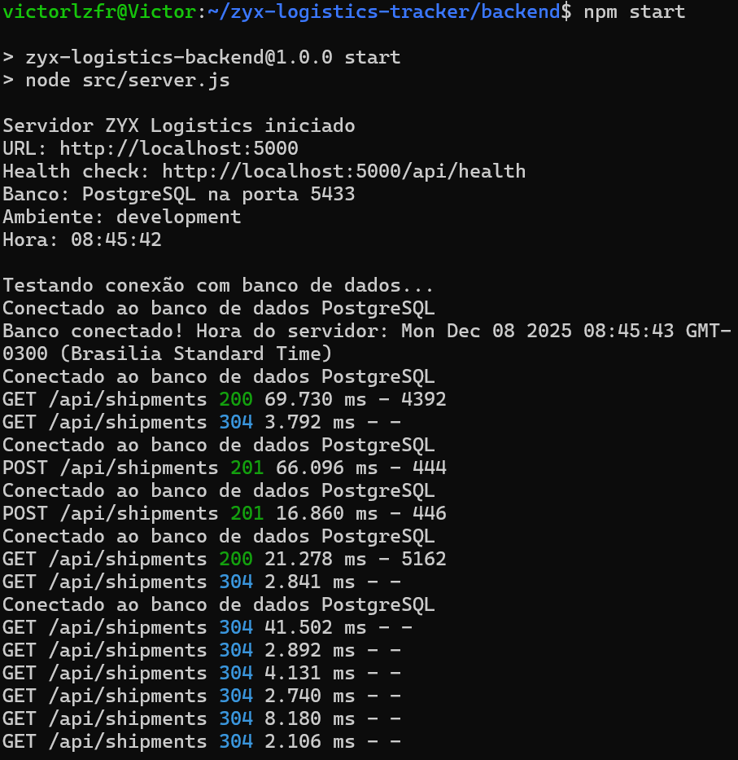
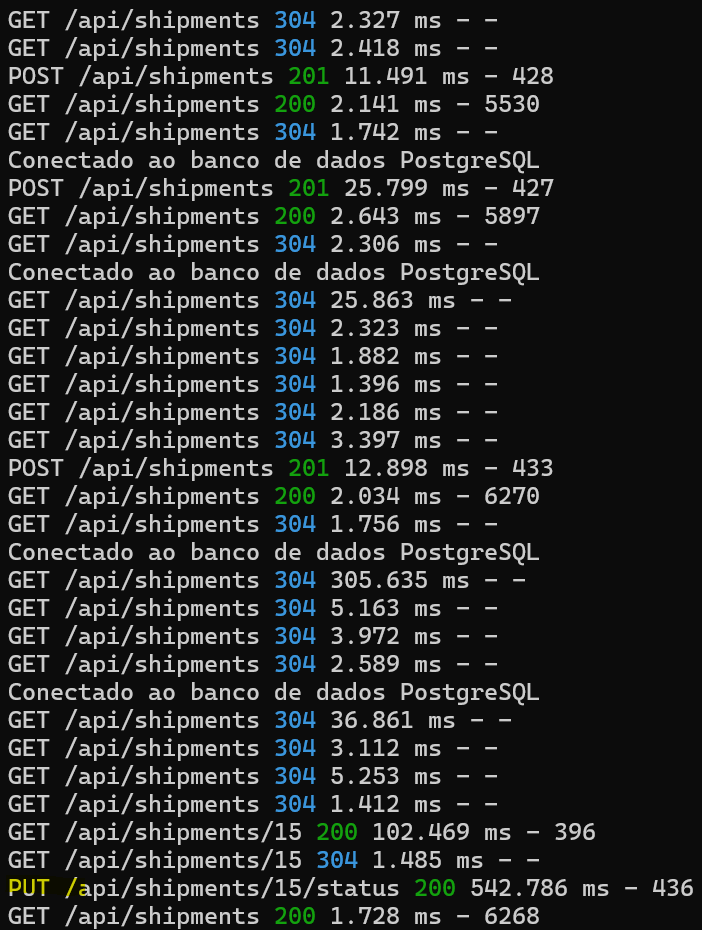
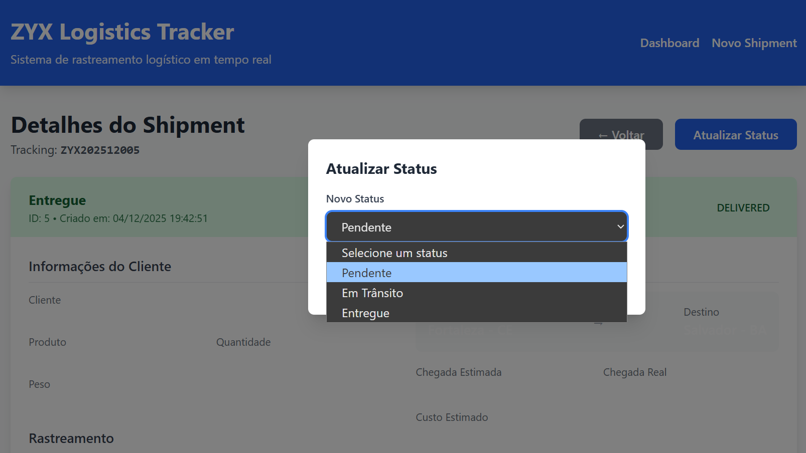

# ZYX Logistics Tracker

Sistema completo de rastreamento logístico desenvolvido para o teste técnico da DHL (Analista de Sistemas Operacionais JR).

## Objetivo do Projeto

Digitalizar os processos logísticos da ZYX Logística, resolvendo os gargalos críticos identificados:
- **Inbound**: Recebimento de cargas com controle eficiente
- **Inventário**: Controle e rastreabilidade de shipments
- **Entrada/Saída**: Registro eletrônico do que entra e sai
- **Expedição**: Lançamento e controle eficiente
- **Relatórios**: Dashboard em tempo real com status consolidado

## Tecnologias Utilizadas

### Backend
- **Node.js 20** + **Express** - API REST
- **PostgreSQL 15** - Banco de dados relacional
- **Docker** + **Docker Compose** - Containerização
- **RESTful API** - 5 endpoints documentados

### Frontend  
- **React 18** + **Vite** - Interface moderna
- **Tailwind CSS** - Design system utilitário
- **React Router 6** - Navegação SPA
- **Axios** - Comunicação HTTP com interceptors

## Estrutura do Projeto
zyx-logistics-tracker/
├── backend/ # API REST completa (Node.js/Express)
├── frontend/ # Interface React moderna
├── development-log/ # 12+ sessões documentadas
├── docs/ # Screenshots + histórico
└── README.md # Esta documentação

## Como Executar o Projeto

### Pré-requisitos
- Node.js 18+
- Docker e Docker Compose
- PostgreSQL (ou usar Docker)

### Passo 1: Banco de Dados
```bash
cd backend
docker-compose up -d

### Passo 2: Backend API
cd backend
npm install
npm start
# API rodando em http://localhost:5000

### Passo 3: Frontend React
cd frontend
npm install
npm run dev
# Aplicação rodando em http://localhost:5173
```

## Endpoints da API
Método	Endpoint				Descrição			Status
GET	/api/shipments				Lista todos os shipments	Implementado
GET	/api/shipments/:id			Busca shipment por ID		Implementado
GET	/api/shipments/tracking/:trackingNumber	Busca por tracking number	Implementado
POST	/api/shipments				Cria novo shipment		Implementado
PUT	/api/shipments/:id/status		Atualiza status do shipment	Implementado

## Screenshots

- **Dashboard Principal** 
  
  

- **Formulário de Criação** 
  
  

- **Página de Detalhes** 
  
  

- **Logs do Backend (CRUD funcionando)** 
  
  

- **Modal de Atualização**
  

## Funcionalidades Implementadas
### CRUD Completo
- CREATE: Formulário com validação para novos shipments

- READ: Listagem completa + página de detalhes individuais

- PDATE: Atualização de status em tempo real via modal

- DELETE: Não implementado por decisão de negócio (mantém histórico)

## Interface Profissional
- Dashboard responsivo com Tailwind CSS

- Navegação SPA com React Router (3 páginas)

- Feedback visual em todas as ações (loading, success, error)

- Status color-coded (Pendente/Em Trânsito/Entregue)

## Integração Robusta
- Proxy Vite configurado para evitar CORS

- Logs de requisições em tempo real no backend

- Validações tanto no frontend quanto no backend

- Tratamento de erros elegante com mensagens ao usuário

## Banco de Dados
### Schema Principal
- Shipments: Tabela principal com tracking_number único

- shipment_tracking: Histórico de alterações (pronto para expansão)

- vw_shipment_dashboard: View consolidada para relatórios

### Dados de Exemplo
- O sistema vem pré-carregado com 10+ shipments de exemplo cobrindo:

- Status (Pendente, Em Trânsito, Entregue)

- Clientes variados (Tech Solutions, Global Import, Distribuidora XYZ)

- Rotas múltiplas (São Paulo → Rio, Fortaleza → Salvador, etc.)

- Tipos de carga diversos (eletrônicos, alimentos, máquinas industriais)

## Decisões Técnicas Importantes
- CRUD completo exceto DELETE: Em sistemas logísticos, histórico completo é crucial para rastreabilidade

- Arquitetura em camadas: Frontend (React), Backend (Express), Banco (PostgreSQL) bem separados

- Documentação extensa: 12+ sessões de desenvolvimento registradas em development-log/

- Pronto para produção: Código limpo, testes realizados, estrutura escalável

## Próximas Expansões Possíveis
- Autenticação JWT: Sistema de login para diferentes níveis de usuário

- Filtros Avançados: Por data, status, cliente, origem/destino

- Relatórios PDF/Excel: Exportação de dados para formatos empresariais

- Notificações: Email/SMS para atualizações importantes de status

- API Externa: Integração com Google Maps para visualização de rotas

- Dashboard Analítico: Gráficos e métricas de performance logística

## Logs de Desempenho (Comprovando Funcionamento)

POST /api/shipments 201 12.898 ms - 433     # CREATE rápido
GET /api/shipments 200 2.034 ms - 6270      # READ lista rápido
GET /api/shipments/15 200 102.469 ms - 396  # READ detalhes
PUT /api/shipments/15/status 200 542.786 ms - 436  # UPDATE funcionando

## Histórico de Desenvolvimento
- O projeto foi desenvolvido em 12+ sessões documentadas, mostrando:

- Evolução da arquitetura

- Resolução de problemas técnicos

- Decisões de design e implementação

- Processo iterativo e organizado

- Todas as sessões estão em development-log/ organizadas por data.

Desenvolvido por: Victor Luiz de França
Para: Teste Técnico DHL - Analista de Sistemas Operacionais JR
Data de Entrega: 08/12/2025
Repositório: https://github.com/victorlzfr/zyx-logistics-tracker
